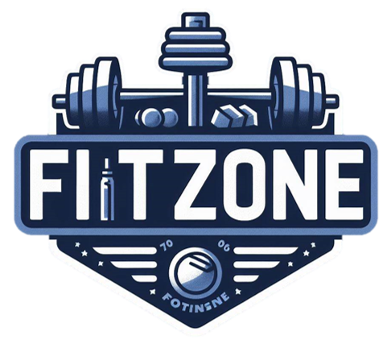

<h1 align="center">Fitzone Academy API</h1>
Essa é uma API ReST de uma academia fictícia. A ideia é permitir que clientes acessem a academia por meio de um código de acesso.

## Tecnologias
- Spring Boot
- MySQL
- Autenticação com JSON Web Tokens (JWT)
